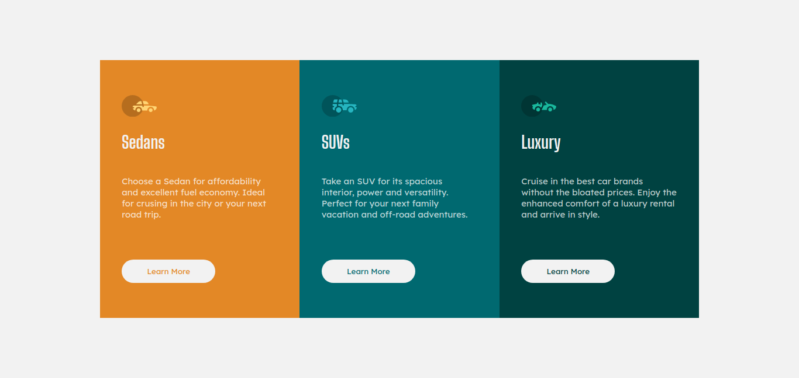

# Frontend Mentor - 3-column preview card component solution

This is a solution to the [3-column preview card component challenge on Frontend Mentor](https://www.frontendmentor.io/challenges/3column-preview-card-component-pH92eAR2-). Frontend Mentor challenges help you improve your coding skills by building realistic projects. 

## Table of contents

- [Frontend Mentor - 3-column preview card component solution](#frontend-mentor---3-column-preview-card-component-solution)
  - [Table of contents](#table-of-contents)
  - [Overview](#overview)
    - [The challenge](#the-challenge)
    - [My Solution Screenshot](#my-solution-screenshot)
    - [Links](#links)
  - [My process](#my-process)
    - [Built with](#built-with)
    - [Time Spent](#time-spent)
    - [What I learned](#what-i-learned)
    - [Continued development](#continued-development)
    - [Useful resources](#useful-resources)
  - [Author](#author)

## Overview

### The challenge

Users should be able to:

- View the optimal layout depending on their device's screen size
- See hover states for interactive elements

### My Solution Screenshot

### Links

- Solution URL: [https://github.com/maryojo/3-column-preview-card-component]()
- Live Site URL: [https://maryojo.github.io/3-column-card-preview-component/]()

## My process

### Built with

- Semantic HTML5 markup
- CSS custom properties
- Flexbox
- CSS Grid
- Mobile-first workflow
<!-- - [React](https://reactjs.org/) - JS library -->
<!-- - [Next.js](https://nextjs.org/) - React framework -->
<!-- - [Styled Components](https://styled-components.com/) - For styles -->

### Time Spent
1 hour 5 mins

### What I learned

The major things I learnt were creating better responsive interfaces, writing neater code and fast coding.

### Continued development

I want to keep working on responsiveness and writing cleaner codes. I would also complete more Frontend Mentor Challenges to be better at converting design to code.

### Useful resources

- [W3 Schools](https://www.w3schools.com/) - This has always been my go-to website for most challenges I face or code I want to remember

## Testing
I performed accessibility tests on my work using Lighthouse and it gave a 76%.

## Author

<!-- - Website - [Mary Ojo](https://www.your-site.com) -->
- Frontend Mentor - [@maryojo](https://www.frontendmentor.io/profile/maryojo)
- Follow me on Twitter - [@maryojo_mo](https://www.twitter.com/maryojo_mo)

